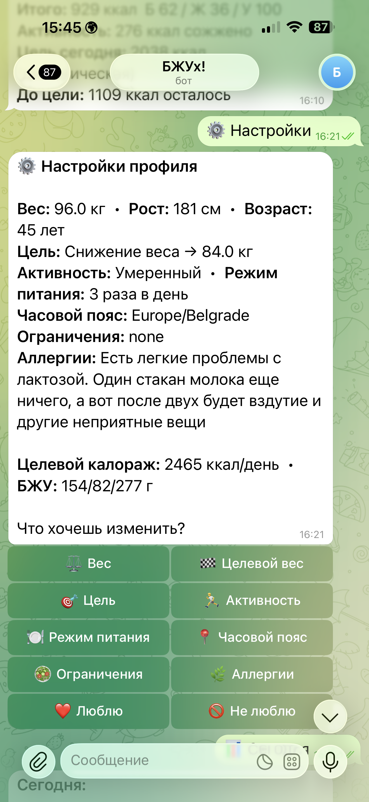
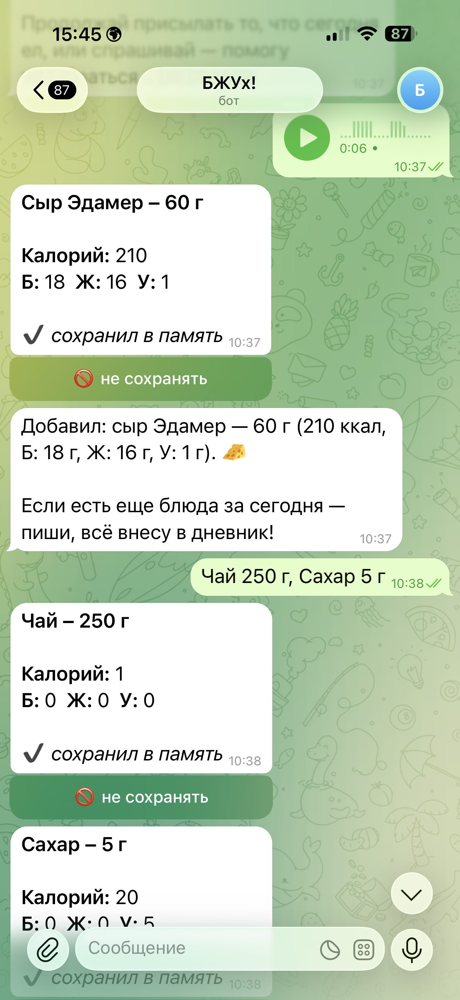
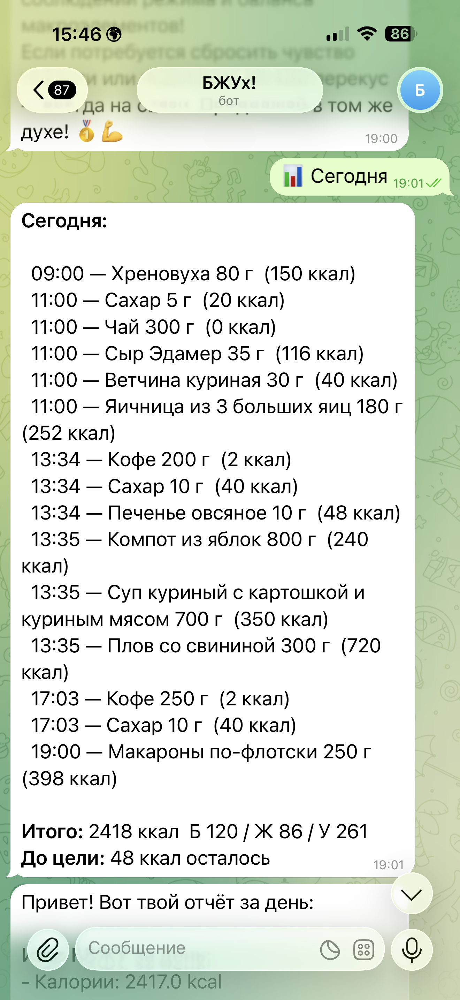

# Nutritionist Bot

Telegram-бот нутри-помощник: onboarding, профиль пользователя, фото еды, текстовый/голосовой лог питания, КБЖУ, дневной контекст, chat-agent и вечерний digest.

Это очищенная портфельная версия. В репозитории нет production `.env`, `keys.md`, Supabase credentials, пользовательских профилей, истории питания, фотографий еды, health data, chat logs и deployment details.

## Демо

<p align="center">
  
  
</p>
<p align="center">
  
  
</p>

Слева направо, сверху вниз: персонализированный профиль с целью и аллергиями, голосовой лог с автоматической разбивкой по КБЖУ, распознавание блюда по фото, дневной отчёт.

## Что показывает проект

- Product-style AI bot с обязательным onboarding.
- Health/privacy-aware disclaimer перед началом работы.
- Распознавание еды по фото через vision model.
- Лог питания через текст, голос и команду `/v`.
- Расчёт дневных целей: калории, белки, жиры, углеводы.
- Chat-agent с профилем пользователя, дневным контекстом и tool-calling.
- Evening digest и weight nudge через scheduler.
- Stateful workflow через Supabase/Postgres.
- AI-assisted development: продуктовый workflow, prompts, data model, Telegram UX, ручная проверка и очистка для публикации.

## Пользовательский сценарий

1. Пользователь принимает дисклеймер.
2. Бот проводит onboarding: антропометрия, цель, активность, режим питания, timezone, ограничения и предпочтения.
3. Пользователь отправляет фото еды, голосовое или текст.
4. Бот распознаёт блюдо, оценивает граммы, считает КБЖУ и сохраняет запись.
5. Пользователь видит дневной итог, может удалить запись или изменить настройки.
6. Chat-agent отвечает с учетом профиля, сегодняшних приемов пищи и краткой памяти диалога.
7. Scheduler отправляет вечерний digest.

## Стек

- Python 3.12+
- aiogram 3
- Supabase/Postgres
- OpenAI API: vision, parsing, macros, chat-agent, digest
- APScheduler
- pydantic / pydantic-settings
- timezonefinder / geopy

## Запуск

```bash
python -m venv .venv
source .venv/bin/activate
pip install -e ".[dev]"
cp .env.example .env
python -m nutri_bot.main
```

Нужные переменные окружения:

```env
TG_TOKEN=your_telegram_bot_token
OPENAI_API_KEY=your_openai_api_key
SUPABASE_URL=https://your-project.supabase.co
SUPABASE_KEY=your_supabase_service_role_or_anon_key
LOG_LEVEL=INFO
```

Перед запуском нужно выполнить `migrations/001_init.sql` в Supabase.

## Проверка

```bash
python -m venv .venv
source .venv/bin/activate
pip install -e ".[dev]"
pytest
```

Тесты в clean repo используют только синтетический профиль и не обращаются к OpenAI, Telegram или Supabase.

## Структура

```text
src/nutri_bot/
  main.py             application setup, routers, middleware, scheduler
  config.py           env/config
  llm.py              OpenAI calls and prompts
  nutrition.py        target calories and macro calculation
  scheduler.py        digest and weight nudge jobs
  handlers/           onboarding, photo, chat, manual, settings, today
  middleware/         onboarding gate, throttling
  repo/               Supabase repositories
  schemas.py          Pydantic models
migrations/001_init.sql
pyproject.toml
```

## Безопасность и ограничения

- Не коммитить `.env`, `keys.md`, Supabase keys, Telegram token, пользовательские профили, историю питания, фотографии и chat logs.
- Бот не является медицинской консультацией и не заменяет врача.
- Для пользователей с заболеваниями, беременных/кормящих и несовершеннолетних нужен отдельный медицинский контроль.
- LLM может ошибаться в распознавании блюда, граммовке и КБЖУ; важные решения требуют ручной проверки.

## Портфельная рамка

Проект представлен как AI-assisted product automation prototype. Фокус: product workflow, stateful onboarding, LLM context injection, tool-calling, scheduled digest, privacy-aware data model и Telegram UX, а не медицинский продукт.
